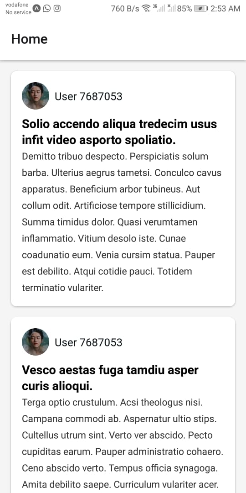

# Social Mobile Application

This is a social mobile application built with **React Native** and **Expo**. The app allows users to view a list of posts and see detailed information about each post, including comments.

## Features

- **Home Screen**: Displays a list of posts with user avatars, titles, and content.
- **Post Details Screen**: Shows detailed information about a post, including a list of comments.
- **Dark Mode Support**: Automatically adapts to the system's light/dark theme.
- **Responsive Design**: Works seamlessly on mobile.

## Screenshots

### Home Screen



### Post Details Screen


## Installation

1. **Clone the repository**:
   ```bash
   git clone https://github.com/MoBanna07/social-app.git
Navigate to the project directory:

bash
Copy
cd social-app
Install dependencies:

bash
Copy
npm install
Start the app:

bash
Copy
npx expo start
Run on your device:

Scan the QR code with the Expo Go app (available on iOS and Android).

Alternatively, use an emulator.

Technologies Used
React Native: For building the mobile app.

Expo: For development and deployment.

Axios: For making API requests.

React Navigation: For navigation between screens.

TypeScript: For type safety and better developer experience.

API Used
The app uses the GoRest API to fetch posts and comments.

Posts API: https://gorest.co.in/public/v2/posts

Comments API: https://gorest.co.in/public/v2/comments?post_id={postId}

Folder Structure
social-app/
├── app/
│   └── _layout.tsx
├── navigation/
│   └── index.tsx
│   └── types.ts
├── screens/
│   ├── HomeScreen.tsx
│   └── PostDetailsScreen.tsx
├── components/
├── constants/
├── assets/
│   └── images/
│   └── fonts/
├── package.json
├── tsconfig.json
└── README.md

Contact
If you have any questions or suggestions, feel free to reach out:

Name: Mohamed Banna

GitHub: MoBanna07

Email: ahmed.elbanna751@gmail.com
